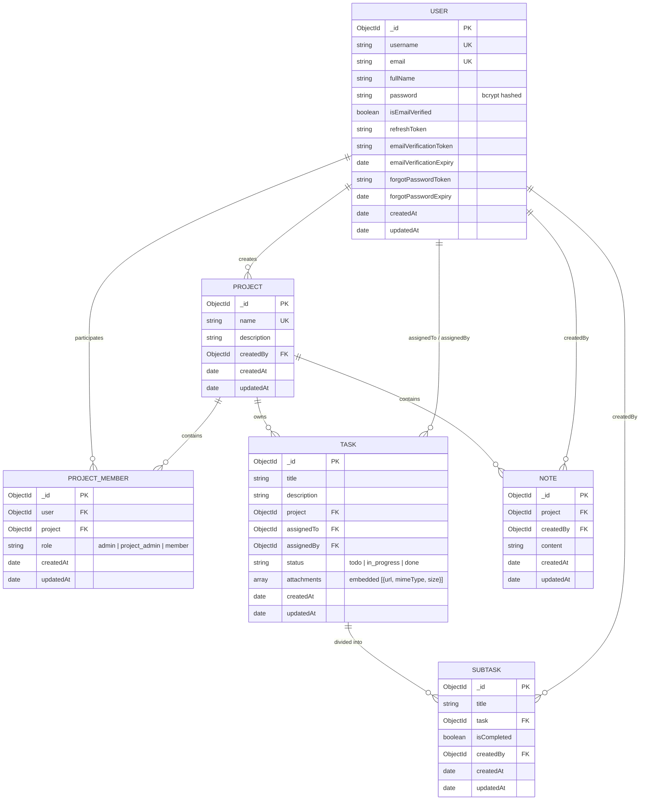

# Project Camp Backend — Architecture Document

**Version:** 1.0.0  
**Product Type:** RESTful Backend API for Collaborative Project Management  
**Architecture Style:** Layered Modular RESTful Micro-Monolith  
**Runtime:** Node.js (ES Modules)  
**Framework:** Express.js 5.x  
**Database:** MongoDB via Mongoose ODM  

---

## 1. Architectural Overview & System Goals

Project Camp Backend is designed as a robust, decoupled, and maintainable REST API supporting collaborative project management. It empowers distributed teams to organize projects, assign roles, manage tasks with hierarchical subtasks, maintain rich project notes, handle multiple file attachments, and enforce granular role-based access control (RBAC).

```
                      ┌─────────────────────────────────┐
                      │          Client Layer           │
                      │  (React / Web App / API Client) │
                      └────────────────┬────────────────┘
                                       │ HTTPS / REST
                                       ▼
                      ┌─────────────────────────────────┐
                      │    Express Application Layer    │
                      │     (CORS, BodyParsers, Auth)   │
                      └────────────────┬────────────────┘
                                       │
         ┌─────────────────────────────┼─────────────────────────────┐
         ▼                             ▼                             ▼
┌──────────────────┐          ┌──────────────────┐          ┌──────────────────┐
│  Auth & Identity │          │ Project & Teams  │          │ Tasks & Content  │
│  - JWT & Crypto  │          │ - Project Lifecycle│        │ - Tasks & Status │
│  - Email Verify  │          │ - Member Roles   │          │ - Subtasks       │
│  - Password Mgmt │          │ - RBAC Guard     │          │ - Project Notes  │
└────────┬─────────┘          └────────┬─────────┘          └────────┬─────────┘
         │                             │                             │
         └─────────────────────────────┼─────────────────────────────┘
                                       │
                      ┌────────────────┴────────────────┐
                      │    Data Access & Schema Layer   │
                      │     (Mongoose Models & Hooks)   │
                      └────────────────┬────────────────┘
                                       │
         ┌─────────────────────────────┴─────────────────────────────┐
         ▼                                                           ▼
┌─────────────────────────────────┐                 ┌─────────────────────────────────┐
│         MongoDB Database        │                 │        File & Email System      │
│ (Users, Projects, Tasks, Notes) │                 │ (Local Storage, Mailgen, SMTP)  │
└─────────────────────────────────┘                 └─────────────────────────────────┘
```

### Key Architectural Drivers
1. **Defense-in-Depth Security**: Stateless JWT authentication with short-lived access tokens, rotatable refresh tokens stored in HTTP-only cookies, crypto-hashed verification tokens, and strict role validation.
2. **Modular Layering**: Clear separation of concerns between Routing, Middleware validation/authorization, Controller orchestration, and Data Persistence.
3. **Multi-Tenant Project Isolation**: User permissions are evaluated within the context of specific projects via a dedicated `ProjectMember` association entity.
4. **Predictable Interface**: Standardized response envelopes (`ApiResponse`) and consistent structured error formatting (`ApiError`).
5. **High Data Integrity**: Pre-save cryptographic hashing, cascading deletes on dependent subtasks, and strong schema validation.

---

## 2. Layered Architecture Design

The backend is built around a classic 4-tier layered architectural pattern:

```
┌────────────────────────────────────────────────────────────────────────┐
│ 1. PRESENTATION & ROUTING LAYER                                        │
│    Routes (/api/v1/auth, /api/v1/projects, /api/v1/tasks, /notes)      │
└───────────────────────────────────┬────────────────────────────────────┘
                                    │
┌───────────────────────────────────▼────────────────────────────────────┐
│ 2. MIDDLEWARE & INTERCEPTOR LAYER                                      │
│    - Global Interceptors (CORS, JSON/Urlencoded, CookieParser)         │
│    - Authentication Guard (verifyJWT)                                  │
│    - Role & Project Permission Guard (validateProjectPermission)       │
│    - File Attachment Engine (Multer)                                   │
│    - Request DTO Validation (express-validator)                        │
└───────────────────────────────────┬────────────────────────────────────┘
                                    │
┌───────────────────────────────────▼────────────────────────────────────┐
│ 3. APPLICATION & CONTROLLER LAYER                                     │
│    - Business Logic Orchestration                                      │
│    - Asynchronous Error Wrapping (asyncHandler)                        │
│    - Service Coordination (Email dispatch, Token generation)           │
│    - Response Formatting (ApiResponse)                                 │
└───────────────────────────────────┬────────────────────────────────────┘
                                    │
┌───────────────────────────────────▼────────────────────────────────────┐
│ 4. DATA PERSISTENCE & INFRASTRUCTURE LAYER                             │
│    - Mongoose Schemas & Middlewares (User, Project, Task, Subtask...) │
│    - MongoDB Atlas Connection Pooling                                  │
│    - File System Storage (`public/images/`)                            │
│    - External Notification Services (Nodemailer / Mailtrap SMTP)       │
└────────────────────────────────────────────────────────────────────────┘
```

### Component Responsibility Matrix

| Component | Files | Primary Responsibility |
|---|---|---|
| **Server Bootstrap** | `src/index.js`, `src/app.js` | Initializes environment, Express instance, connects MongoDB, configures global middlewares, registers versioned routes. |
| **Database Connection** | `src/db/index.js` | Manages MongoDB connection lifecycle, handles connection errors and auto-reconnects. |
| **Routing** | `src/routes/*.routes.js` | Maps HTTP verbs and URIs to middleware pipelines and controller handlers under `/api/v1`. |
| **Middlewares** | `src/middlewares/*.js` | Enforces authentication (`verifyJWT`), project RBAC (`validateProjectPermission`), file uploads (`multer`), and input validation. |
| **Controllers** | `src/controllers/*.js` | Extracts inputs, executes domain logic, queries database, produces HTTP status codes with `ApiResponse`. |
| **Models** | `src/models/*.model.js` | Defines document schemas, indices, validation rules, bcrypt hooks, and helper methods. |
| **Validators** | `src/validators/index.js` | Declarative express-validator rules ensuring request payloads meet contract specifications before hitting controllers. |
| **Utilities** | `src/utils/*.js` | Shared constructs: `ApiError`, `ApiResponse`, `asyncHandler`, `mail.js`, and system constants (`constants.js`). |

---

## 3. Security & Access Control Architecture

### 3.1 Dual-Token Authentication System

The application employs a dual-token JWT mechanism to balance security with seamless user sessions:

```
Client                             Server                            Database
  │                                   │                                  │
  │─── POST /api/v1/auth/login ──────>│                                  │
  │    (email/username, password)     │                                  │
  │                                   │─── Validate User & Password ────>│
  │                                   │<── Return User Record ───────────│
  │                                   │                                  │
  │                                   │─── Generate Tokens:              │
  │                                   │    - Access Token (Short-lived)  │
  │                                   │    - Refresh Token (Long-lived)  │
  │                                   │                                  │
  │                                   │─── Store hashed refreshToken ───>│
  │                                   │                                  │
  │<── Set HttpOnly Cookies ──────────│                                  │
  │    (accessToken, refreshToken)    │                                  │
  │    Return User DTO                │                                  │
  │                                   │                                  │
```

#### Token Properties:
- **Access Token**:
  - Contains identity payload (`_id`, `email`, `username`).
  - Signed with `ACCESS_TOKEN_SECRET`.
  - Short validity period (configured via `ACCESS_TOKEN_EXPIRY`, e.g., 1 day or 15 mins).
  - Transmitted via `Authorization: Bearer <token>` header or `accessToken` cookie.
- **Refresh Token**:
  - Contains minimal subject payload (`_id`).
  - Signed with `REFRESH_TOKEN_SECRET`.
  - Longer validity period (configured via `REFRESH_TOKEN_EXPIRY`, e.g., 10 days).
  - Persisted on the `User` document in MongoDB for invalidation upon logout.
  - Set as an `HttpOnly`, `SameSite` cookie to mitigate XSS attacks.

### 3.2 Role-Based Access Control (RBAC) Architecture

Project Camp implements a **Scoped Multi-Tenant RBAC** model. Rather than granting global permissions, user privileges are determined per-project through the `ProjectMember` junction model.

```
       ┌────────────────────────┐
       │   User (Identity)      │
       └───────────┬────────────┘
                   │ 1
                   │
                   ▼ *
       ┌────────────────────────┐         * ┌────────────────────────┐
       │     ProjectMember      │──────────>│       Project          │
       │ (user, project, role)  │           │ (name, createdBy, ...) │
       └────────────────────────┘           └────────────────────────┘
                   │
                   │ Role: admin | project_admin | member
                   ▼
       ┌────────────────────────┐
       │ Permissions Evaluated  │
       └────────────────────────┘
```

#### Three-Tier Permission Hierarchy:
1. **Admin (`admin`)**:
   - Creator of the project or promoted project owner.
   - Full management: update/delete project, invite/remove members, assign roles, create notes, create/update/delete tasks and subtasks.
2. **Project Admin (`project_admin`)**:
   - Operational manager of project execution.
   - Task & subtask management: create, update, delete tasks and subtasks.
   - Read-only access to project notes.
   - Cannot delete projects, manage project members, or create project notes.
3. **Member (`member`)**:
   - Individual contributor.
   - View project tasks, subtasks, notes, and team members.
   - Update subtask completion status (`isCompleted`).
   - Cannot create/delete tasks, create notes, or alter project structure.

#### RBAC Permission Matrix

| Resource & Operation | HTTP Method & URI | Admin | Project Admin | Member |
|---|---|:---:|:---:|:---:|
| **Create Project** | `POST /api/v1/projects` | ✓ | ✗ | ✗ |
| **Update Project** | `PUT /api/v1/projects/:id` | ✓ | ✗ | ✗ |
| **Delete Project** | `DELETE /api/v1/projects/:id` | ✓ | ✗ | ✗ |
| **View Project Details** | `GET /api/v1/projects/:id` | ✓ | ✓ | ✓ |
| **List User Projects** | `GET /api/v1/projects` | ✓ | ✓ | ✓ |
| **Manage Members (Add/Role/Remove)**| `POST/PUT/DELETE .../members` | ✓ | ✗ | ✗ |
| **List Project Members** | `GET /api/v1/projects/:id/members` | ✓ | ✓ | ✓ |
| **Create Task** | `POST /api/v1/tasks/:projectId` | ✓ | ✓ | ✗ |
| **Update Task** | `PUT /api/v1/tasks/:projectId/t/:taskId` | ✓ | ✓ | ✗ |
| **Delete Task** | `DELETE /api/v1/tasks/:projectId/t/:taskId` | ✓ | ✓ | ✗ |
| **View Tasks** | `GET /api/v1/tasks/:projectId` | ✓ | ✓ | ✓ |
| **Create Subtask** | `POST .../t/:taskId/subtasks` | ✓ | ✓ | ✗ |
| **Update Subtask Status** | `PUT .../st/:subTaskId` | ✓ | ✓ | ✓ |
| **Update Subtask Title** | `PUT .../st/:subTaskId` | ✓ | ✓ | ✗ |
| **Delete Subtask** | `DELETE .../st/:subTaskId` | ✓ | ✓ | ✗ |
| **Create Note** | `POST /api/v1/notes/:projectId` | ✓ | ✗ | ✗ |
| **Update / Delete Note** | `PUT/DELETE .../n/:noteId` | ✓ | ✗ | ✗ |
| **View Notes** | `GET /api/v1/notes/:projectId` | ✓ | ✓ | ✓ |

### 3.3 Middleware Authorization Pipeline

Authorization is enforced at the route definition level via higher-order middleware:

```javascript
// Step 1: verifyJWT authenticates token and attaches req.user
router.use(verifyJWT);

// Step 2: validateProjectPermission verifies membership and authorizes allowed roles
router.route("/:projectId/t/:taskId")
  .delete(
    validateProjectPermission([UserRolesEnum.ADMIN, UserRolesEnum.PROJECT_ADMIN]),
    deleteTask
  );
```

```
Incoming Request
      │
      ▼
[ verifyJWT ]
  ├── 1. Extract Token from Cookies or Bearer Header
  ├── 2. Verify Signature with ACCESS_TOKEN_SECRET
  ├── 3. Query User from DB (omit secrets)
  └── 4. Attach req.user (or throw 401 Unauthorized)
      │
      ▼
[ validateProjectPermission(allowedRoles) ]
  ├── 1. Extract projectId from req.params
  ├── 2. Query ProjectMember for (user: req.user._id, project: projectId)
  ├── 3. If no membership found -> throw 400/404 Not Found
  ├── 4. Attach req.user.role = memberRole
  └── 5. Check if allowedRoles.includes(memberRole) (or throw 403 Forbidden)
      │
      ▼
[ Request Validation Middleware ]
  └── Express-validator check (or throw 422 Unprocessable Entity)
      │
      ▼
[ Target Controller Execution ]
```

---

## 4. Data Architecture & Entity Relationships (ERD)

The database schema is modeled in MongoDB using Mongoose with normalized references for scalable many-to-many associations and embedded sub-documents for fast read access.



### Schema Design Highlights:
1. **Junction Collection (`ProjectMember`)**: Facilitates multi-tenancy, fast lookups with compound indexes `{ project: 1, user: 1 }`, and flexible role assignments without bloating user or project documents.
2. **Embedded Attachments**: Tasks store an array of attachment metadata subdocuments (`url`, `mimeType`, `size`) directly within the task document, minimizing join operations during task views.
3. **Cascading Integrity**: When a `Task` is deleted, its child `Subtask` documents are automatically purged in the controller logic (`Subtask.deleteMany({ task: taskId })`).
4. **Mongoose Lifecycle Hooks**:
   - `User.pre("save")`: Automatically detects password changes and hashes plain text passwords via `bcrypt.hash(password, 10)`.

---

## 5. Storage & File Management Architecture

The backend supports multiple file attachments on tasks (e.g. screenshots, documents, specification files):

```
Client Multi-part Request (FormData)
              │
              │ multipart/form-data
              ▼
    [ Multer DiskStorage ]
              │
              ├── Destination: ./public/images
              ├── Filename: Date.now() + "-" + originalname
              └── FileSize Limit: 1 MB
              │
              ▼
     Local Disk Storage
   (public/images/<timestamp>-file.png)
              │
              ▼
   Task Controller Metadata Generation
   [
     {
       url: `${SERVER_URL}/images/${filename}`,
       mimeType: file.mimetype,
       size: file.size
     }
   ]
              │
              ▼
   Saved in Task Document (MongoDB)
```

- **Static Asset Serving**: Files written to `public/images` are served via Express static middleware: `app.use(express.static("public"))`.
- **Public URL Resolution**: Stored URLs dynamically format with `process.env.SERVER_URL` or relative paths for frontend flexibility.

---

## 6. Email Notification Architecture

Asynchronous email dispatch is used for critical authentication security events:

```
Trigger Event (Register / Forgot Password)
                    │
                    ▼
           Token Generation
  - Unhashed Token (Sent in link)
  - SHA-256 Hashed Token (Saved in DB)
  - 20-minute expiry timestamp
                    │
                    ▼
      Mailgen Template Builder
  - Professional HTML & Plaintext formatting
  - Verification & Reset action button URLs
                    │
                    ▼
       Nodemailer SMTP Transport
  - Connects to SMTP Server (Mailtrap sandbox / Production SMTP)
  - Dispatches message to user's registered inbox
```

- **Token Security**: Tokens are generated via `crypto.randomBytes(20).toString("hex")`. Only the SHA-256 hash is saved in MongoDB. The unhashed version is dispatched in the email URL. Upon retrieval, the incoming token is hashed and matched with an expiry check (`$gt: Date.now()`).

---

## 7. Error Handling & API Response Envelope Architecture

### 7.1 Unified Response Envelope (`ApiResponse`)

All successful API responses return a standard contract:

```json
{
  "statusCode": 200,
  "data": { ... },
  "message": "Resource fetched successfully",
  "success": true
}
```

### 7.2 Unified Error Envelope (`ApiError`)

Exceptions thrown anywhere in the application inherit from `ApiError` and are intercepted by the global error handler:

```json
{
  "statusCode": 403,
  "data": null,
  "message": "You do not have permission to perform this action",
  "success": false,
  "errors": []
}
```

```
Route Handler / Middleware
            │
      Throws ApiError
            │
            ▼
    [ asyncHandler ]
   Promise.catch(next)
            │
            ▼
 [ Express Error Middleware ]
            │
   Extracts err.statusCode || 500
   Formats structured JSON
            │
            ▼
   Client receives uniform JSON
```

---

## 8. Deployment & Operational Architecture

```
                       ┌───────────────────────────────┐
                       │     Reverse Proxy (Nginx)     │
                       │     SSL / TLS Termination     │
                       └───────────────┬───────────────┘
                                       │
                                       ▼
                       ┌───────────────────────────────┐
                       │     Node.js Express Server    │
                       │     (Port: 8000 / Process)    │
                       └───────┬───────────────┬───────┘
                               │               │
                 ┌─────────────┘               └─────────────┐
                 ▼                                           ▼
┌─────────────────────────────────┐         ┌─────────────────────────────────┐
│       MongoDB Atlas Cluster     │         │      Mailtrap / SMTP Provider   │
│   (Replication, Indexes, Auth)  │         │  (Email delivery & monitoring)  │
└─────────────────────────────────┘         └─────────────────────────────────┘
```

### Environment Configuration Strategy
The application relies on 12-factor configuration through environment variables (`.env`):
- `PORT`: HTTP listener port (default: 8000).
- `MONGO_URI`: MongoDB connection string.
- `CORS_ORIGIN`: Allowed origins for cross-origin resource sharing.
- `ACCESS_TOKEN_SECRET` / `ACCESS_TOKEN_EXPIRY`: JWT signing key and lifespan.
- `REFRESH_TOKEN_SECRET` / `REFRESH_TOKEN_EXPIRY`: Refresh token secret and lifespan.
- `MAILTRAP_SMTP_*`: SMTP credentials for verification and password reset emails.
- `SERVER_URL`: Hostname used for file attachment absolute URL resolution.

### Health Monitoring
- Endpoint: `GET /api/v1/healthcheck`
- Responds with `200 OK` and `{ message: "Server is running" }` to support uptime probes, load balancer health checks, and container readiness verification.

---

## 9. Summary & Architectural Invariants

1. **Explicit Permissions**: Every project route validates that the requesting user is an active member of that project before exposing or mutating data.
2. **Idempotent / Safe Operations**: Destructive actions (deletes, updates) verify both project context and ownership, preventing ID-enumeration vulnerabilities.
3. **Stateless Scale**: Auth state is maintained through JWT signatures and database-backed refresh tokens, allowing the API service to scale horizontally behind a load balancer.
